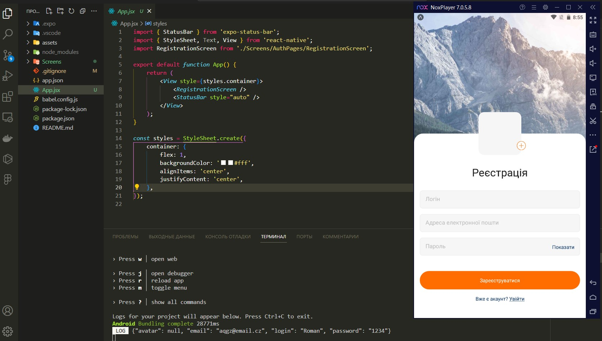

# goit-react-native-hw-03

## Завдання

1. Додати логіку роботи з формою в компонент `RegistrationScreen`
2. Додати логіку роботи з формою в компонент `LoginScreen`
3. Під час сабміту форм збирати дані з них і виводити в консоль
4. Додати автозакриття клавіатури по кліку за межами форм (Використовуємо `Keyboard.dismiss`)

